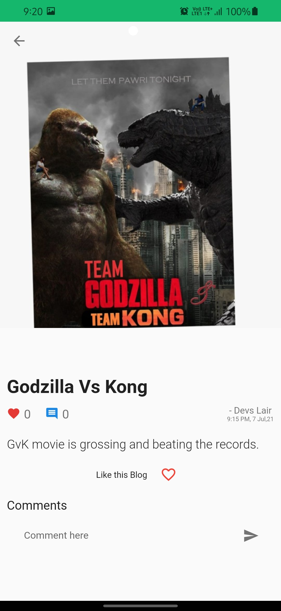
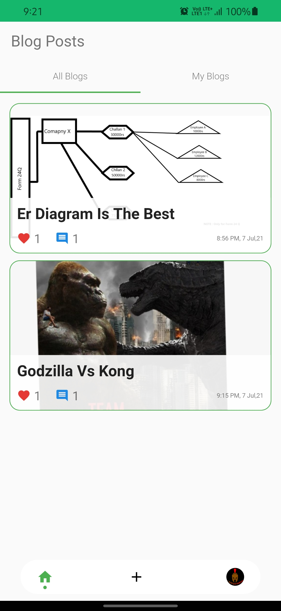

# blogapp
A blog application built using flutter.
1.  User can sign in using his/her google account.
2.  User can post their own blogs and display them to other users.
3.  User can comment and like the blogs of others and own's.

# Screens
1. Sign-In Screen

2. Profile Screen

3. Add New Blog Screen

4. All Blogs Screen - 1

5. My Blogs Screen

6. Blog Screen

7. Blog Screen with likes and Comments

8. All Blogs Screen - 2

  

